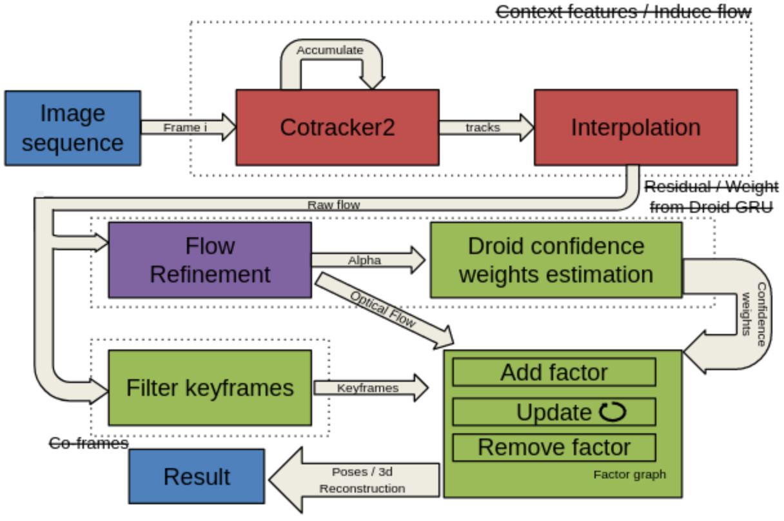

# DPT-SLAM





[DPT-SLAM: Dense Point Tracking for Visual SLAM](report.pdf)

Tjark Behrens, Damiano Da Col, Théo Ducrey and Wenqing Wang


**Initial Code Release:** This directory currently provides our implementation of DPT-SLAM as described in our report. This work was done in the context of the course 3D Vision at ETH Zürich.

File structure of principal parts and contributions:                                  

```
DPT-SLAM
├── datasets
│   ├── TartanAir                            -> Data : Contain the different scenes we used for testing
│   │   ├── P001
│   │   ├── P002
│   │   └── P003
│   ├── TartanAir_small                      -> Data : Contain the different scenes we used for fast testing of new functions
├── evaluation_scripts/validate_tartanair.py -> Evaluation : line 106 may be edited to switch testing between the different scenes
├── droid_slam                               -> Implementation : Droid : rewritten to support 4x downsampling of DPT-SLAM instead of 8x of DROID,
│   │                                           Implementation : reshape the image once in initialization instead of reshaping it every time when
│   │                                                            computing point tracks and refined flows.
│   ├── thirdparty
│   │   ├── DOT
│   │   │   ├── Checkpoints
│   │   │   ├── dot
│   │   │   │   ├── models
│   │   │   │   │   ├── point_tracking.py    -> Implementation : Point sampling using Harris corner detection and grid,
│   │   │   │   │   │                           Implementation : logic for frequent resampling to keep a minimum nbr of visible points
│   │   │   │   │   │                           Implementation : handling multiple instances of cotracker and track merging
│   │   │   │   │   ├── optical_flow.py      -> Implementation : Add a new mode "flow_between_frames", which takes the track from online CoTracker and outputs the refined flow.
│   │   │   │   │                               Implementation : Save the flow in a dictionary to reduce computation redundancy. 
│   │   │   │   │                               Implementation : Add EPE saving and visualizing function to help analysis of the code.
│   │   │   │   │                               Implementation : Add Gaussian weight approximation function
│   │   │   │   │                               Implementation : Add a weight visualization function
│   ├── depth_video.py                       -> Implementation : Changed distance measure, now selecting pairs of frames to add to graph based on flow magnitude.
│   ├── droid_frontend.py                    -> Implementation : Rewrote to now use DPT_SLAM update step instead of DROID_SLAM update step.
│   ├── droid.py                             -> Implementation : Implemented a track buffer to feed frames by group of window's size to CoTracker, deleted the backend of DROID.
│   ├── factory_graph.py                     -> Implementation : Entirely rewrote to support new update step of DPT-SLAM
│   │                                           Implementation : Integrated the refined flow into the DROID SLAM system.
│   ├── motion_filter.py                     -> Implementation : In function plot_traj_video, implemented visualization of tracks for a given video.
├── tools/validate_tartanair.sh              -> Implementation : Added logic to make all videos of length divisible by 4, adding last image before processing and deleting again added images before getting evaluation result.
│   │                                           Evaluation : Has variable to be modified to switch testing between small scene and actual scene of TartanAir.
```


## Requirements

* **Inference:** Reproducing our run without training will require a GPU with at least 11G of memory. 

## Getting Started
1. Download the complete project including the checkpoint, test_data, codes of each repositery directly from polybox: [https://polybox.ethz.ch/index.php/s/THgcqijIfKN5bHo]
```
dataset -> DPT-SLAM
Checkpoints -> DPT-SLAM/droid_slam/thirdparty/DOT
```

[Optionally] Without polybox access
```
git clone --recursive git@github.com:behretj/DPT-SLAM.git
cd DPT-SLAM/thirdparty/DOT/
wget -P checkpoints https://huggingface.co/16lemoing/dot/resolve/main/cvo_raft_patch_8.pth
wget -P checkpoints https://huggingface.co/16lemoing/dot/resolve/main/movi_f_raft_patch_4_alpha.pth
wget -P checkpoints https://huggingface.co/16lemoing/dot/resolve/main/movi_f_cotracker2_patch_4_wind_8.pth
wget -P checkpoints https://huggingface.co/16lemoing/dot/resolve/main/panning_movi_e_tapir.pth
wget -P checkpoints https://huggingface.co/16lemoing/dot/resolve/main/panning_movi_e_plus_bootstapir.pth

Download scene to add in DPT-SLAM/dataset/TartanAir from https://theairlab.org/tartanair-dataset/ but keep in mind most of them require more than 11go of memory if kept in full
(For us consider linking to main team directory :  ln -s /cluster/courses/3dv/data/team-4/DOT-SLAM/datasets datasets)
```


2. Install dependencies

Create and activate a virtual environment
```
python3 -m venv env_dpt
source env_dpt/bin/activate
```


##### Using Command line : 

Install the [PyTorch and TorchVision](https://pytorch.org/get-started/locally/) versions which are compatible with your CUDA configuration. The environment setup was tested on CUDA 12.1, ${CUDA} should be replaced with the specific version (for CUDA 12.1, it's ${CUDA} = cu121).
```
pip install --no-cache-dir torch torchvision --index-url https://download.pytorch.org/whl/${CUDA}
```

Install Droid-SLAM inference dependencies
```
pip install matplotlib==3.8.4 numpy==1.26.3 tensorboard opencv-python scipy tqdm suitesparse-graphblas PyYAML gdown
pip install torch-scatter -f https://data.pyg.org/whl/torch-2.1.0+${CUDA}.html
pip install evo --upgrade --no-binary evo
pip install ninja
```

Compile the extensions (takes about 10 minutes) (need to be done on a gpu node -> for us within a job) :
```
python setup.py install
```

In our case :

```
chmod +111 setup.py
sbatch < $root_path$/DPT-SLAM/job-install.sh

job-install.sh:
#!/bin/bash
#SBATCH --account=3dv
#SBATCH --nodes 1                  # 24 cores
#SBATCH --gpus 1
###SBATCH --gres=gpumem:24g
#SBATCH --time 02:00:00        ### adapt to our needs
#SBATCH --mem-per-cpu=12000
###SBATCH -J analysis1
#SBATCH -o job_output/dpt-slam%j.out
#SBATCH -e job_output/dpt-slam%j.err
###SBATCH --mail-type=END,FAIL

. /etc/profile.d/modules.sh
module load cuda/12.1
export CUB_HOME=$root_path$/DPT-SLAM/thirdparty/DOT/dot/utils/torch3d/cub-2.1.0
echo $CUB_HOME
export CXXFLAGS="-std=c++17"

echo "working"
export PYTHONPATH="$root_path$/DPT-SLAM/droid_slam/thirdparty/DOT"
source $root_path$/DPT-SLAM/env_dpt/bin/activate
cd $root_path$/DPT-SLAM
python ./setup.py install
echo "finished"

```

Install DOT inference dependencies.
```
pip install einops einshape timm lmdb av mediapy
```

DSet up custom modules from [PyTorch3D](https://github.com/facebookresearch/pytorch3d) to increase speed and reduce memory consumption of interpolation operations.
```
cd thirdparty/DOT/dot/utils/torch3d/ && pip install . && cd ../../..
```


##### Using a Job : 
``` 
#!/bin/bash
#SBATCH --account=3dv
#SBATCH --nodes=1                  # 24 cores
#SBATCH --gpus=1
###SBATCH --gres=gpumem:24g
#SBATCH --time 00:30:00        ### adapt to our needs
#SBATCH --mem-per-cpu=12000
###SBATCH -J analysis1
#SBATCH -o installation%j.out
#SBATCH -e installation%j.err
###SBATCH --mail-type=END,FAIL

. /etc/profile.d/modules.sh
module load cuda/12.1
export CUB_HOME=$root_dir$//DPT-SLAM/thirdparty/DOT/dot/utils/torch3d/cub-2.1.0
echo $CUB_HOME
export CXXFLAGS="-std=c++17"


echo "working"

source $root_dir$/DPT-SLAM/dpt_slam_env/bin/activate

cd $root_dir$/DPT-SLAM

#### put python commands here

pip install --no-cache-dir torch torchvision --index-url https://download.pytorch.org/whl/cu121

pip install matplotlib==3.8.4 numpy==1.26.3 tensorboard opencv-python scipy tqdm suitesparse-graphblas PyYAML gdown
pip install torch-scatter -f https://data.pyg.org/whl/torch-2.1.0+cu121.html
pip install evo --upgrade --no-binary evo

python setup.py install

pip install einops einshape timm lmdb av mediapy

cd thirdparty/DOT/dot/utils/torch3d/ && pip install . && cd ../../..

# ./tools/validate_tartanair.sh

echo "finished"
```

For a full list of all package versions of a working environment, check ```requirements.txt```. We strongly recommend following the step-by-step guide of setting up the environment instead of using the file.

## Run

Run the demo on any of the samples (all demos can be run on a GPU with 11G of memory).

Sbatch
```
Create file job.sh with the content of the next section
& sbatch < job.sh
```

or using Python
```
Execute the termminal command of the job bellow
```

Job example (replace 'root_path' )
```
#!/bin/bash
#SBATCH --account=3dv
#SBATCH --nodes 1                  # 24 cores
#SBATCH --gpus 1
###SBATCH --gres=gpumem:24g
#SBATCH --time 02:00:00        ### adapt to our needs
#SBATCH --mem-per-cpu=12000
###SBATCH -J analysis1
#SBATCH -o job_output/dpt-slam%j.out
#SBATCH -e job_output/dpt-slam%j.err
###SBATCH --mail-type=END,FAIL

. /etc/profile.d/modules.sh
module load cuda/12.1
export CUB_HOME=$root_path$/DPT-SLAM/thirdparty/DOT/dot/utils/torch3d/cub-2.1.0
echo $CUB_HOME
export CXXFLAGS="-std=c++17"

echo "working"
export PYTHONPATH="$root_path$/DPT-SLAM/droid_slam/thirdparty/DOT"
echo $PYTHONPATH
source $root_path$/DPT-SLAM/env_dpt/bin/activate
cd $root_path$/DPT-SLAM
./tools/validate_tartanair.sh --plot_curve
echo "finished"
```

Output
```
In a directory job_output at the location from where sbatch was called or directly in the console
``` 

## Evaluation

### Changing the scene 
Set the line 114 of validate_tatanair.py accordingly 
```
test_split = ["P001 || P002 || P003"]
```
### Switching between harris and grid point sampling 
Set the line 55 of point_tracking.py accordingly
```
self.init_sampl_func = sampling_inititization_functions['harris || grid']
```

### Changing nbr of point tracked/resampled 
Set the default parameters of line 347 of point_tracking.py accordingly
```
get_tracks_online_droid(self, data, num_tracks=512, sim_tracks=512,**kwargs):
```

### Changing resampling frequency 
Set the minimum point threshold as wanted:  higher = more frequent, lower = less frequent
```
threshold_minimum_nbr_visible_tracks_wanted = (7*S)//8
```
  
